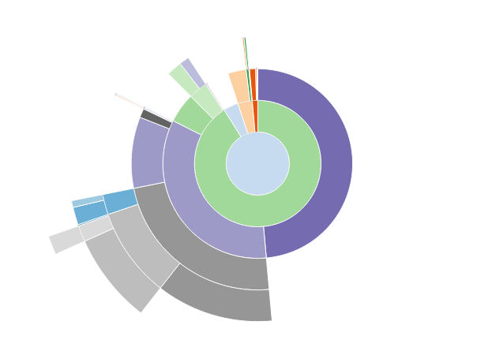
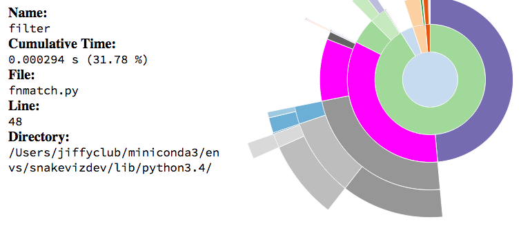
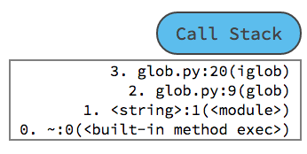
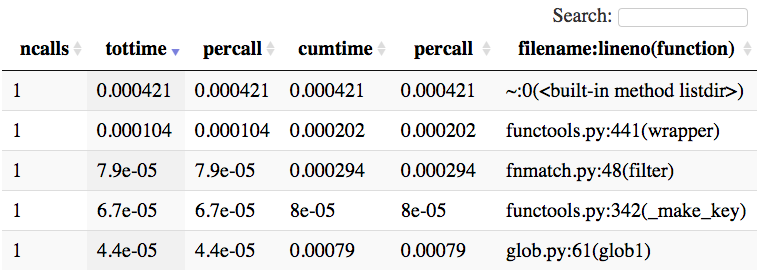

# SnakeViz

SnakeViz is a browser based graphical viewer for the output of Python's
[cProfile][] module and an alternative to using the standard library
[pstats module][pstats].
It was originally inspired by [RunSnakeRun][].
SnakeViz works on Python 2.7 and Python 3.
SnakeViz itself is still likely to work on Python 2.6,
but official support has been dropped now that [Tornado][] no longer
supports Python 2.6.

## Installation

SnakeViz is available [on PyPI][pypi]. Install with [pip][]:

```
pip install snakeviz
```

## Starting SnakeViz

### Command Line Interface

If you have generated a profile file called `program.prof` you can start
SnakeViz from the command line:

```
snakeviz program.prof
```

Run `snakeviz --help` to see available options.

Note that you can provide a directory as the argument to `snakeviz`
and it will launch a file browser interface from which you can select
profiles to view or other directories to list.
For example: `snakeviz path/to/directory`.

### IPython

SnakeViz includes IPython line and cell magics for going straight
from code to a visualization.
First load the magics:

```
%load_ext snakeviz
```

Then use the `%snakeviz` (for a single line of code) and
`%%snakeviz` (for multiple lines of code) magics to profile and view
individual lines or entire blocks of code:

```
% snakeviz glob.glob('*.txt')
```

```
%%snakeviz
files = glob.glob('*.txt')
for file in files:
    with open(file) as f:
        print(hashlib.md5(f.read().encode('utf-8')).hexdigest())
```

When used within a a Jupyter Notebook the `%snakeviz` magics
embed the visualization result within the notebook by default.
The `--new-tab` or `-t` options can be passed to the magic to instead make
SnakeViz open in a new browser tab.
Opening in a new browser tab is the default behavior when the
`%snakeviz` magics are used outside of notebooks.

Note: Using the IPython `%snakeviz` magics requires internet access.
If you are working offline, use [prun][] to save a profile file
and then start SnakeViz from the command line.

## Generating Profiles

### cProfile

You can use the [cProfile][] module at the command line to create a
profile file for a script:

```
python -m cProfile -o program.prof my_program.py
```

See the [user's manual][generating] for more info and other options.

(Note that SnakeViz **does not** work with profiles generated by the
`profile` module.)

### IPython

You can also generate profile files of specific code using
IPython's [prun][] magic using the `-D` flag:

```
%prun -D program.prof glob.glob('*.txt')
```

`prun` has both line and cell magics available,
see the [IPython docs][prun] for more information.

## Interpreting Results

SnakeViz has two visualization styles, icicle (the default) and sunburst.
In both the fraction of time spent in a function is represented by the
extent of a visualization element, either the width of a rectangle or
the angular extent of an arc.
You can switch between the two styles using the "Style" dropdown.
(See more below under [Controls](#controls).)

Functions don't only spend time calling other functions, they also have their
own internal time. SnakeViz shows this by putting a special child on each node
that represents internal time. Only functions that call other functions will
have this, functions with no calls are entirely internal time.

### Icicle


In the icicle visualization style functions are represented by rectangles.
A root function is the top-most rectangle, with functions it calls below it,
then the functions those call below them, and so on.
The amount of time spent inside a function is represented by the width
of the rectangle.
A rectangle that stretches across most of the visualization represents
a function that is taking up most of the time of its calling function,
while a skinny rectangle represents a function that is using hardly
any time at all.

### Sunburst



In the sunburst visualization style functions are represented as arcs.
A root function is a circle at the middle, with functions it calls around,
then the functions those functions call, and so on.
The amount of time spent inside a function is represented by
the angular extent of the arc (how far around the circle it goes).
An arc that wraps most of the way around the circle represents a function
that is taking up most of the time of its calling function, while a
skinny arc represents a function that is using hardly any time at all.

### Function Info

Placing your cursor over a rectangle or arc will highlight that function
and any other visible instances of the same function call.
It will also display a list of information to the left of the sunburst.



The displayed information includes:

- **Name:** function name
- **Cumulative Time:** total cumulative amount of time spent in the function
    in seconds and as a percentage of the total program run time
- **File:** name of the file in which the function is defined
- **Line:** line number on which the function is defined
- **Directory:** directory of the file

Note: For some built-in functions the file name, line number, and
directory will be '~', 0, and blank, respectively.

### Zooming and Call Stack

Clicking on a function will zoom the visualization, making that function
the new root and allowing you to magnify different parts of the profile.
Clicking the top bar of the icicle visualization or the center of the sunburst
will zoom out one level and clicking the "Reset Zoom" button will return the
visualization to its most zoomed-out state.



To the right of the vizualization is a "Call Stack" button.
Clicking this will expand a list that shows all the functions
leading up to the current root of the vizualization, with the root function
at the bottom of the list.
The call stack can be useful for orienting yourself when you've zoomed
into the profile.
Click the "Call Stack" button again to hide the list.

### Stats Table

Below the visualization is a table of profile data similar to the
one you'd see working with Python's built-in [cProfile][] and [pstats][]
modules.



The table contains one row per unique function called.
Calls to the same function from different places are all grouped into
one row.
The columns are the same as described in the
[cProfile user's manual][generating]:

- **ncalls:** Total number of calls to the function.
    If there are two numbers, that means the function recursed and
    the first is the total number of calls
    and the second is the number of primitive (non-recursive) calls.
- **tottime:** Total time spent in the function,
    not including time spent in calls to sub-functions
- **percall:** `tottime` divided by `ncalls`
- **cumtime:** Cumulative time spent in this function and all sub-functions
- **percall:** `cumtime` divided by `ncalls`
- **filename:lineno(function):** File name and line number were the
    function is defined, and the function's name

The columns of the table are all sortable and the search box can be used
to filter the table based on the **filename:lineno(function)** column.

Clicking on a function in the table will make that function the root
of the visualization.
Clicking the "Reset Root" button to the left of the visualization will
reset the vizualization to its original root function as determined when
SnakeViz was started.

## Controls

SnakeViz has multiple controls that affect the visualization.
(And clicking the "SnakeViz" text will bring you to these docs.)


### Reset Zoom

If you've zoomed into a profile by clicking on the visualization, clicking
the "Reset Zoom" button will reset the visualization to the currently
selected root function.

### Reset Root

If you've changed the root function by clicking on the [stats table](#stats-table),
clicking the "Reset Root" button will reset the visualization to the root
function determined when SnakeViz first started.

### Style

Use the "Style" dropdown to switch between the [icicle](#icicle) and
[sunburst](#sunburst) visualization styles.

### Depth

The "Depth" dropdown controls how deep into the call stack SnakeViz
goes when building the visualization.
Anything below this depth will not be shown until you zoom in by
clicking on a new function deeper in the call stack.
Increasing the displayed depth will show more of your profile at once,
but it can take longer to build and display the graph.

### Cutoff

The "Cutoff" dropdown controls the display of functions that take up very l
ittle of their parents' cumulative time.
If a function's cumulative time divided by its parent's cumulative time
is less than the currently set cutoff, then that function will be displayed
but none of its sub-functions will be.
Setting a larger cutoff may display less of a profile,
but can speed up the building and rendering of the visualization.

## Notes

- SnakeViz currently only works with files produced by `cProfile`,
  it will not work with files from the `profile` module.
- SnakeViz will sometimes be unable to create a visualization and will
  show an error.
  This is usually because the visualization is too complex.
  You can make a simpler graph by increasing the cutoff, reducing the depth,
  or profiling a smaller subsection of your code.
- `cProfile`'s data does not always allow a full reconstruction of where time
  was spent in a program, especially when functions are called multiple
  times from different parts of the code. When that happens SnakeViz can only
  show the total amount of time spent in a function, not the amount spent
  there when called by a specific caller.
  [This issue](https://github.com/jiffyclub/snakeviz/issues/112) details
  this limitation.

## Contact

If you'd like to contribute to SnakeViz you can [fork it on GitHub][gh].
Please report issues on the [GitHub issue tracker][issues].

[cProfile]: https://docs.python.org/3/library/profile.html#module-cProfile
[RunSnakeRun]: http://www.vrplumber.com/programming/runsnakerun/
[Tornado]: http://www.tornadoweb.org/
[pypi]: https://pypi.org/project/snakeviz/
[pip]: https://pip.pypa.io
[prun]: http://ipython.org/ipython-doc/2/api/generated/IPython.core.magics.execution.html#IPython.core.magics.execution.ExecutionMagics.prun
[generating]: https://docs.python.org/3/library/profile.html#instant-user-s-manual
[pstats]: https://docs.python.org/3/library/profile.html#module-pstats
[gh]: https://github.com/jiffyclub/snakeviz
[issues]: https://github.com/jiffyclub/snakeviz/issues
